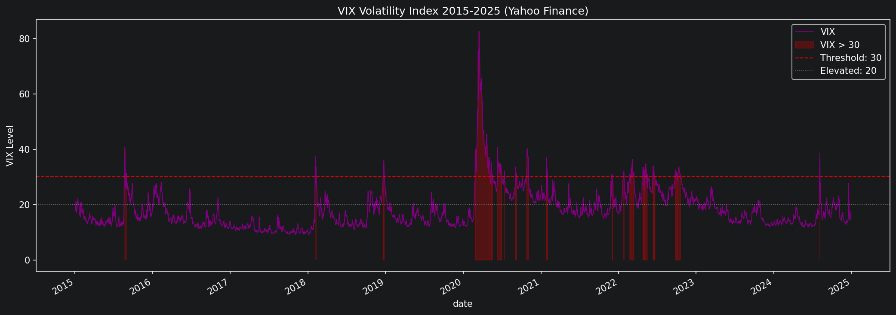
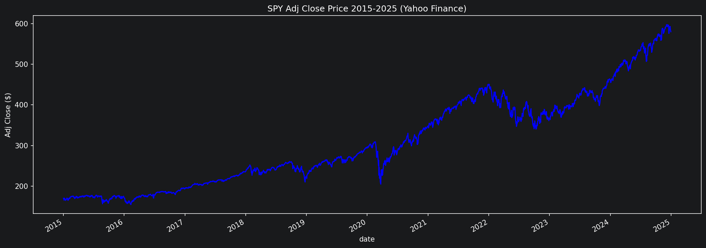
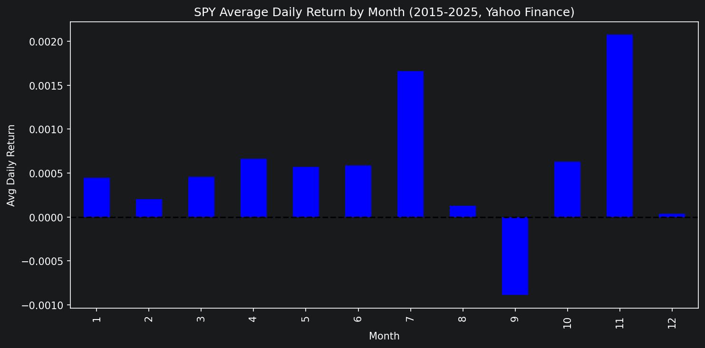
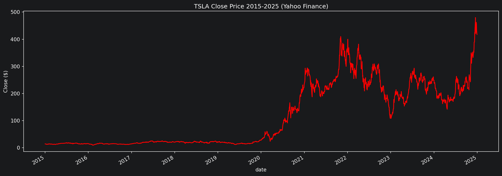
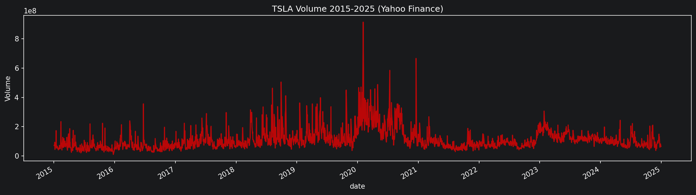
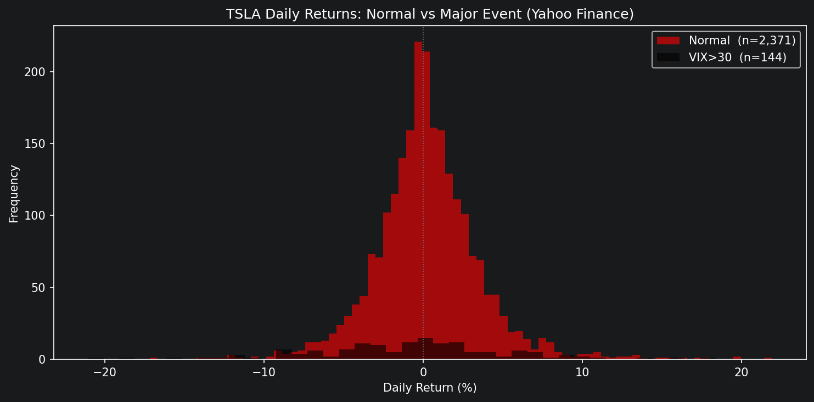
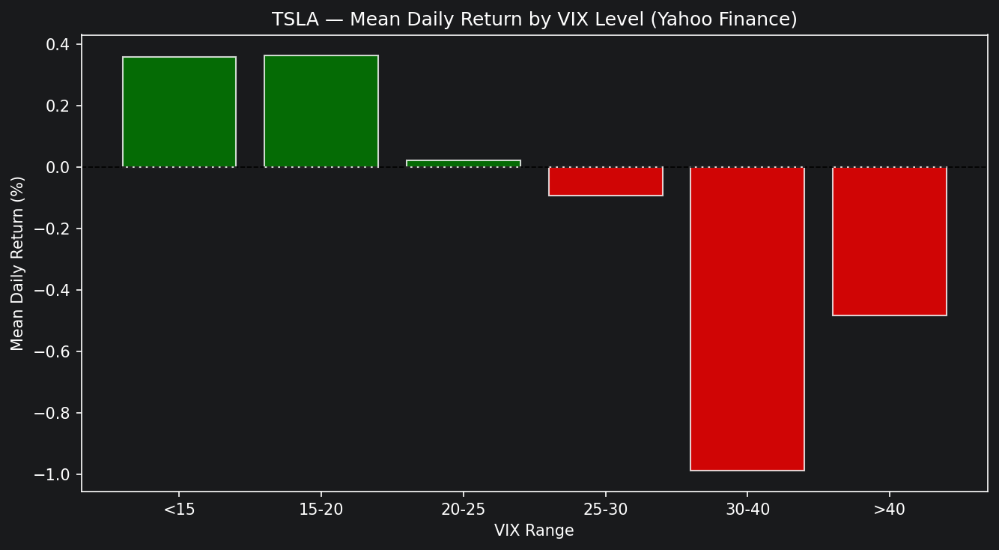
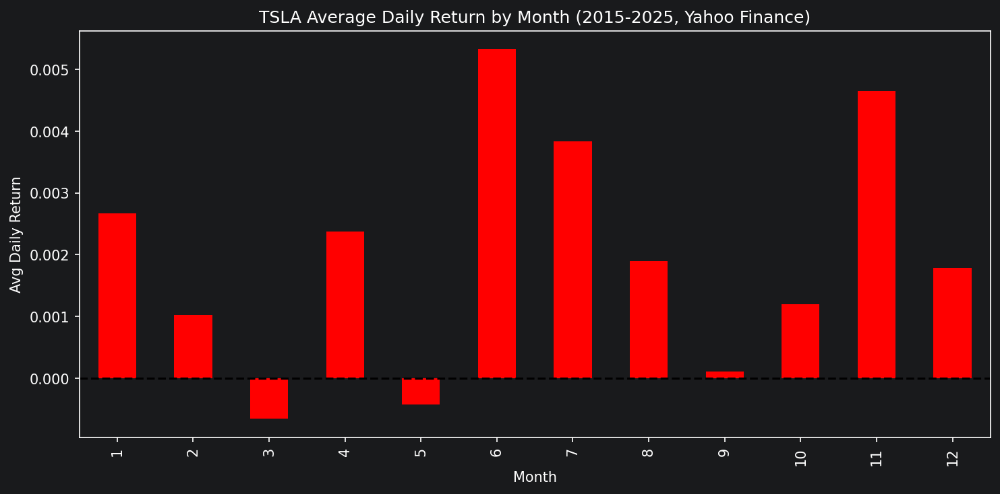

# SEIS-763: Midterm Project — Stock Market Movement Prediction

**Team Members:** Brahmee Adhikari, Don C. Nguyen

---

## Goal

This project builds machine learning models to predict stock price movement using historical daily price data. Two tasks are performed:

1. **Classification** — Predict whether a stock's price will go **UP or DOWN** the next trading day.
2. **Regression** — Predict **how much the price will change** over the next 5 trading days.

Both tasks are applied to two tickers:
- **SPY** — An S&P 500 ETF representing a stable, broad-market benchmark
- **TSLA** — Tesla, Inc., a high-volatility individual stock

Comparing the two tickers reveals whether stability or volatility makes a stock easier to predict, and how extreme market events affect model performance.

---

## Data Source

Historical daily stock price data is sourced from the **Yahoo Finance API (yfinance)**. Data spans **10 years** of trading days (2015–2024) for both SPY and TSLA (~2,515 rows each). Each trading day includes the following native attributes:

| Attribute | Description |
|---|---|
| `open` | Price at market open |
| `high` | Highest price of the day |
| `low` | Lowest price of the day |
| `close` | Unadjusted price at market close |
| `adj_close` | Dividend-adjusted closing price (relevant for SPY) |
| `volume` | Number of shares traded |

From these attributes, additional features are derived (see Key Terms below).

---

## Key Terms

### Stock Market Terms

| Term | Definition |
|---|---|
| **Daily Return** | The percentage change in a stock's closing price from one day to the next. Captures short-term momentum. |
| **Weekly Return** | The percentage change in closing price over the past 5 trading days (~1 week). |
| **Moving Average (20-day)** | The average closing price over the past 20 trading days. Smooths out noise and reveals the medium-term trend. |
| **Distance from 20-day MA** | How far today's price is above or below the 20-day moving average, expressed as a percentage. Indicates whether a stock is overbought or oversold relative to its recent trend. |
| **Daily Range** | The difference between a day's high and low price, normalized by the closing price. Measures intraday volatility. |
| **Volume** | The total number of shares traded in a day. High volume often signals strong conviction behind a price move. |
| **Volume Change** | The day-over-day percentage change in trading volume. |
| **VWAP (Volume Weighted Average Price)** | The average price a stock traded at throughout the day, weighted by volume. A common institutional benchmark. |
| **VWAP Distance** | How far the closing price is from VWAP. Indicates whether the stock closed above or below the average trade price. |
| **Volatility (20-day)** | The rolling standard deviation of daily returns over 20 days. Higher values mean more unpredictable price swings. |
| **RSI (Relative Strength Index)** | A momentum indicator scaled 0–100. Values above 70 suggest a stock is overbought; below 30 suggests oversold. Calculated over 14 days. |
| **Bollinger Band Position** | Where today's closing price sits within the Bollinger Bands, which are set 2 standard deviations above and below the 20-day moving average. Values near +1 or -1 suggest price is at the edge of its recent range. |
| **VIX (CBOE Volatility Index)** | A real-time index published by the Chicago Board Options Exchange (CBOE) that measures the market's expectation of volatility over the next 30 days. It is derived from the implied volatility of S&P 500 options — when traders are willing to pay more for options (i.e., hedging against large swings), VIX rises. Often called the "fear gauge," VIX tends to spike sharply during crises and remain elevated until conditions stabilize. A VIX above 30 is a widely used threshold for heightened market stress. In this project, VIX daily closing prices are fetched from Yahoo Finance (`^VIX`) and merged into the feature dataset to derive the extreme event indicator. |
| **Extreme Event Indicator** | A boolean (True/False) flag marking trading days where the VIX closing price exceeded 30, indicating a period of elevated market fear or stress. Rather than hardcoding specific crash dates, this approach is data-driven: it automatically captures any shock period in the dataset where volatility was abnormally high. Helps the model distinguish genuine market disruptions from normal day-to-day noise. |
| **SPY** | The SPDR S&P 500 ETF Trust. Tracks the S&P 500 index, representing 500 large U.S. companies. Used here as a stable market benchmark. |
| **TSLA** | Tesla, Inc. A high-growth, high-volatility individual stock used here as a contrast to SPY. |

### Machine Learning Terms

| Term | Definition |
|---|---|
| **Feature (Independent Variable)** | An input variable used by the model to make a prediction. In this project, features include daily return, RSI, volume change, etc. |
| **Target (Dependent Variable)** | The value the model is trying to predict. Here: next-day direction (classification) or 5-day price change (regression). |
| **Classification** | A type of ML task where the model predicts a discrete category. Here: UP or DOWN. |
| **Regression** | A type of ML task where the model predicts a continuous numeric value. Here: 5-day forward return. |
| **Logistic Regression** | A classification algorithm that estimates the probability of a binary outcome (UP or DOWN) using a logistic curve. Simple and interpretable. |
| **Linear Regression** | A regression algorithm that fits a straight line through training data to predict continuous values. |
| **Ridge Regression** | A variant of linear regression that adds a penalty for large coefficients, reducing overfitting when features are correlated. |
| **Random Forest** | An ensemble of many decision trees that each vote on the prediction. More powerful than a single tree and provides built-in feature importance scores. |
| **XGBoost** | A gradient boosting algorithm that builds trees sequentially, each correcting the errors of the previous. Often the top performer on structured/tabular data. |
| **Training** | The process of fitting a model to historical data so it learns patterns. |
| **Testing** | Evaluating the model on data it has never seen to measure real-world performance. |
| **Overfitting** | When a model learns the training data too precisely, including its noise, and fails to generalize to new data. |
| **Walk-Forward Validation** | A time-aware testing strategy where the model is trained on a past window of data and tested on the immediately following window, repeating across multiple periods. Prevents data leakage and simulates real trading conditions. |
| **Data Leakage** | When information from the future accidentally influences the training process, producing misleadingly optimistic results. |
| **Feature Importance / Weights** | A score assigned to each feature indicating how much it influenced the model's predictions. Computed via `model.coef_` for linear models and `model.feature_importances_` for tree-based models. |
| **Standardization (StandardScaler)** | Rescaling features to have a mean of 0 and standard deviation of 1, so no single feature dominates due to scale differences. |
| **MAE (Mean Absolute Error)** | Average absolute difference between predicted and actual values. Intuitive and robust to outliers. |
| **RMSE (Root Mean Squared Error)** | Square root of the average squared error. Penalizes large mistakes more than MAE — important in finance where big misses are costly. |
| **R² (R-squared)** | Proportion of variance in the target explained by the model. A value of 1.0 is perfect; negative values mean the model performs worse than simply predicting the mean. |
| **Precision** | Of all days the model predicted as UP, the fraction that actually went UP. Low precision means the model generates many false buy signals — a trader acting on every UP prediction would frequently lose money on days that actually went down. |
| **Recall** | Of all days that actually went UP, the fraction the model correctly identified. Low recall means the model misses many genuine opportunities — a conservative model that rarely predicts UP will have high precision but low recall. |
| **F1 Score** | Harmonic mean of precision and recall. A single number that balances both risks: false buy signals (low precision) and missed opportunities (low recall). More informative than accuracy alone when classes are nearly balanced. |
| **Confusion Matrix** | A table showing correct and incorrect predictions broken down by class (e.g., Predicted Up vs. Actual Up). |
| **Seasonal Analysis** | Grouping model results by time of year (spring, summer, fall, winter) to identify whether market conditions in certain seasons are more predictable. |
| **Realized Volatility** | The actual, observed volatility of a stock over a past window — computed as the standard deviation of daily returns over N days. Used as the regression target in the second iteration (`target_volatility`), replacing the 5-day forward return. Volatility is more learnable than raw return direction because it is directly driven by the technical features already in the model (VIX, daily range, RSI). |
| **Softened Target** | A classification target that filters out small, ambiguous price moves rather than forcing a binary UP/DOWN label on every day. In the second iteration, days with returns within ±0.5% (SPY) or ±1.5% (TSLA) of zero are labeled FLAT (0) instead of UP or DOWN. This gives the model cleaner signal on days where a genuine trend is present and reduces noise from microstructure. |
| **FLAT Class** | The third label in the softened 3-class classification target (Down = -1, Flat = 0, Up = 1). Represents a trading day where the stock's move was too small to be a meaningful directional signal. Adding FLAT lowers the random-classifier F1 baseline from ~0.50 to ~0.33, so scores above ~0.38 represent meaningful learning. |
| **L2 Regularization** | A penalty added to a model's loss function that discourages large coefficient values. Proportional to the sum of squared coefficients. Ridge Regression applies L2 regularization to reduce overfitting when input features are correlated with each other — which is common with technical indicators (e.g., RSI, Bollinger Band position, and distance from MA all measure similar things). |
| **Embargo (Walk-Forward)** | A mandatory gap of N trading days inserted between the end of a training window and the start of the test window in walk-forward validation. Prevents feature leakage when features are computed over a rolling window — without an embargo, the last rows of the training window and the first rows of the test window share overlapping feature calculations. In this project a **5-day embargo** is applied at each fold boundary. |

---

## Project Structure

```
seis763-midterm/
├── data/                          # Cached CSVs from Yahoo Finance
│   ├── SPY_features.csv
│   └── TSLA_features.csv
├── iteration1/                    # Iter 1: 63d/42d/0d embargo (~9 folds, Polygon 2yr)
│   └── midterm-feature-engineered.ipynb
├── iteration2/                    # Iter 2: 63d/21d/5d embargo (~58 folds, Yahoo 10yr, volatility/3-class targets)
│   ├── data-fetch.ipynb
│   ├── spy_regression.ipynb
│   ├── spy_classification.ipynb
│   ├── tsla_regression.ipynb
│   └── tsla_classification.ipynb
├── iteration3/                    # Iter 3: 3d/1d/0d embargo (~2,507 folds)
│   ├── spy_regression.ipynb
│   ├── spy_classification.ipynb
│   ├── tsla_regression.ipynb
│   └── tsla_classification.ipynb
├── iteration4/                    # Iter 4: 15d/5d/2d embargo (~498 folds)
│   ├── spy_regression.ipynb
│   ├── spy_classification.ipynb
│   ├── tsla_regression.ipynb
│   └── tsla_classification.ipynb
├── feature_engineering.ipynb      # Feature engineering pipeline
├── img/                           # Shared EDA plots
└── deprecated/                    # Archived monolithic source notebooks
    ├── iteration2/
    ├── iteration3/
    └── iteration4/
```

---

## How Testing Is Done

Testing uses **walk-forward validation** — a time-series aware evaluation strategy that prevents data leakage and simulates realistic trading conditions.

### Window Configurations Across Iterations

| Iteration | Train | Test | Embargo | Approx. Folds | Dataset |
|---|---|---|---|---|---|
| 1 | 63d | 42d | 5d | ~58 | Yahoo Finance, 10yr |
| **2** | **189d (SPY) / 59d (TSLA)** | **42d** | **5d** | **55 (SPY) / 58 (TSLA)** | **Yahoo Finance, 10yr** |
| 3 | 3d | 1d | 0d | ~2,507 | Yahoo Finance, 10yr |
| 4 | 15d | 5d | 2d | ~498 | Yahoo Finance, 10yr |

Iteration 2 is the primary production configuration. Iterations 3 and 4 explore the effect of shorter windows and are included as cautionary comparisons.

### Process
Each fold trains the model exclusively on its training window, then predicts the immediately following test window. An embargo separates the two to prevent feature leakage from rolling window calculations. The next fold begins immediately after the previous test window ends:

```
Iteration 2 example (63d/21d/5d):
Fold 1: Train [day 1   → day 63],  Embargo [day 64–68],  Test [day 69  → day 89]
Fold 2: Train [day 69  → day 131], Embargo [day 132–136], Test [day 137 → day 157]
...

Iteration 4 example (15d/5d/2d):
Fold 1: Train [day 1  → day 15],  Embargo [day 16–17],  Test [day 18 → day 22]
Fold 2: Train [day 6  → day 20],  Embargo [day 21–22],  Test [day 23 → day 27]
...
```

This approach captures performance across multiple market conditions rather than a single arbitrary split.

### Metrics Reported
Results are aggregated as **mean ± standard deviation** across all folds.

| Task | Primary Metric | Supporting Metrics |
|---|---|---|
| Regression | RMSE | MAE, R² |
| Classification | F1 Score | Accuracy, Confusion Matrix |

Standard deviation across folds measures **consistency** — a model with lower std is more reliable across different market conditions.

---

## Models

All models are evaluated using walk-forward validation across both tickers independently.

### Regression Models
Predict the **5-day forward return** — the percentage price change from today's close to the close 5 trading days from now. A positive value means the model expects the price to rise; negative means it expects a decline.

| Model | Purpose | Primary Metric | Supporting Metrics |
|---|---|---|---|
| **Linear Regression** | Baseline model. Fits a straight line through the feature space to predict the 5-day return as a weighted sum of inputs. Coefficients reveal which features most influence the prediction. | RMSE | MAE, R² |
| **Ridge Regression** | Extension of linear regression with L2 regularization — penalizes large coefficients to reduce overfitting. Particularly useful here because technical indicators (RSI, Bollinger Band position, distance from MA) are often correlated with each other. | RMSE | MAE, R² |
| **XGBoost** | Gradient boosting ensemble that builds decision trees sequentially, each correcting the residual errors of the prior tree. Captures non-linear relationships between features and returns that linear models cannot, and provides feature importance scores. | RMSE | MAE, R² |

### Classification Models
Predict the **next-day price direction** — whether the stock will close higher (UP = 1) or lower (DOWN = 0) than today.

| Model | Purpose | Primary Metric | Supporting Metrics |
|---|---|---|---|
| **Logistic Regression** | Baseline classifier. Models the probability of an UP move using a logistic curve. Simple and interpretable — log-odds coefficients show which features linearly push the prediction toward UP or DOWN. | F1 | Precision, Recall, Accuracy, Confusion Matrix |
| **Random Forest** | Ensemble of decision trees that each vote independently on direction. More robust than a single tree; handles non-linear feature interactions and is less sensitive to noisy features. Provides feature importance scores based on how often each feature is used to split. | F1 | Precision, Recall, Accuracy, Confusion Matrix |

---

## Results

Results are reported as **mean ± standard deviation** across all walk-forward folds. Standard deviation measures consistency — a lower value means the model performs reliably across different market conditions, not just in one favorable period.

### SPY — Regression (5-day forward return)

| Model | RMSE (mean ± std) | MAE (mean ± std) | R² (mean ± std) |
|---|---|---|---|
| Linear Regression | 0.047786 ± 0.043899 | 0.041183 ± 0.040623 | -7.617818 ± 14.816828 |
| Ridge Regression | 0.039305 ± 0.031435 | 0.033785 ± 0.028524 | -4.249127 ± 5.066583 |
| XGBoost | 0.026246 ± 0.015421 | 0.021343 ± 0.013119 | -1.439560 ± 2.302285 |

### SPY — Classification (next-day direction)

| Model | F1 (mean ± std) | Precision (mean ± std) | Recall (mean ± std) | Accuracy (mean ± std) |
|---|---|---|---|---|
| Logistic Regression | 0.4473 ± 0.0767 | 0.5054 ± 0.1292 | 0.5052 ± 0.0576 | 0.5131 ± 0.0672 |
| Random Forest | 0.4709 ± 0.0827 | 0.5156 ± 0.1204 | 0.5173 ± 0.0626 | 0.5164 ± 0.0728 |

### TSLA — Regression (5-day forward return)

| Model | RMSE (mean ± std) | MAE (mean ± std) | R² (mean ± std) |
|---|---|---|---|
| Linear Regression | 0.188666 ± 0.141773 | 0.157598 ± 0.123677 | -10.193193 ± 29.986320 |
| Ridge Regression | 0.146747 ± 0.099270 | 0.122307 ± 0.083897 | -5.904711 ± 20.436670 |
| XGBoost | 0.100080 ± 0.039484 | 0.082080 ± 0.034292 | -1.331088 ± 2.004227 |

### TSLA — Classification (next-day direction)

| Model | F1 (mean ± std) | Precision (mean ± std) | Recall (mean ± std) | Accuracy (mean ± std) |
|---|---|---|---|---|
| Logistic Regression | 0.4360 ± 0.0919 | 0.4848 ± 0.1309 | 0.4933 ± 0.0727 | 0.4815 ± 0.0866 |
| Random Forest | 0.4622 ± 0.0970 | 0.4991 ± 0.1199 | 0.5045 ± 0.0778 | 0.4885 ± 0.0858 |

### Seasonal Breakdown

Performance broken down by season (Spring: Mar–May, Summer: Jun–Aug, Fall: Sep–Nov, Winter: Dec–Feb) to identify which market periods are most predictable.

#### SPY — Regression

| Model | Season | RMSE | MAE | R² | n |
|---|---|---|---|---|---|
| Linear Regression | Spring | 0.090967 | 0.052895 | -10.2402 | 609 |
| Linear Regression | Summer | 0.050162 | 0.031318 | -4.9798 | 645 |
| Linear Regression | Fall | 0.057973 | 0.042807 | -6.5204 | 630 |
| Linear Regression | Winter | 0.050299 | 0.037936 | -3.7841 | 552 |
| Ridge Regression | Spring | 0.067395 | 0.041570 | -5.1697 | 609 |
| Ridge Regression | Summer | 0.034462 | 0.022517 | -1.8224 | 645 |
| Ridge Regression | Fall | 0.046409 | 0.035314 | -3.8195 | 630 |
| Ridge Regression | Winter | 0.047395 | 0.036617 | -3.2476 | 552 |
| XGBoost | Spring | 0.036428 | 0.024642 | -0.8025 | 609 |
| XGBoost | Summer | 0.025851 | 0.017138 | -0.5881 | 645 |
| XGBoost | Fall | 0.026600 | 0.019825 | -0.5833 | 630 |
| XGBoost | Winter | 0.031921 | 0.024349 | -0.9267 | 552 |

#### SPY — Classification

| Model | Season | F1 | Precision | Recall | Accuracy | n |
|---|---|---|---|---|---|---|
| Logistic Regression | Spring | 0.5009 | 0.5016 | 0.5016 | 0.5057 | 609 |
| **Logistic Regression** | **Summer** | **0.5254** | **0.5260** | **0.5255** | **0.5380** | **645** |
| Logistic Regression | Fall | 0.4767 | 0.4785 | 0.4793 | 0.4889 | 630 |
| Logistic Regression | Winter | 0.5170 | 0.5171 | 0.5173 | 0.5199 | 552 |
| Random Forest | Spring | 0.4932 | 0.4943 | 0.4944 | 0.4992 | 609 |
| **Random Forest** | **Summer** | **0.5466** | **0.5468** | **0.5474** | **0.5519** | **645** |
| Random Forest | Fall | 0.5136 | 0.5136 | 0.5136 | 0.5175 | 630 |
| Random Forest | Winter | 0.4926 | 0.4958 | 0.4957 | 0.4928 | 552 |

#### TSLA — Regression

| Model | Season | RMSE | MAE | R² | n |
|---|---|---|---|---|---|
| Linear Regression | Spring | 0.267672 | 0.164871 | -7.9008 | 609 |
| **Linear Regression** | **Summer** | **0.166826** | **0.122573** | **-3.4015** | **645** |
| Linear Regression | Fall | 0.244311 | 0.164868 | -8.0162 | 630 |
| Linear Regression | Winter | 0.254097 | 0.182201 | -7.1118 | 552 |
| Ridge Regression | Spring | 0.188975 | 0.121857 | -3.4364 | 609 |
| **Ridge Regression** | **Summer** | **0.129840** | **0.093618** | **-1.6662** | **645** |
| Ridge Regression | Fall | 0.185365 | 0.129981 | -4.1903 | 630 |
| Ridge Regression | Winter | 0.198640 | 0.147567 | -3.9574 | 552 |
| XGBoost | Spring | 0.115118 | 0.087031 | -0.6463 | 609 |
| **XGBoost** | **Summer** | **0.099102** | **0.076078** | **-0.5533** | **645** |
| XGBoost | Fall | 0.101906 | 0.079175 | -0.5687 | 630 |
| XGBoost | Winter | 0.114076 | 0.086947 | -0.6349 | 552 |

#### TSLA — Classification

| Model | Season | F1 | Precision | Recall | Accuracy | n |
|---|---|---|---|---|---|---|
| **Logistic Regression** | **Spring** | **0.4843** | **0.4845** | **0.4845** | **0.4844** | **609** |
| Logistic Regression | Summer | 0.4837 | 0.4862 | 0.4863 | 0.4837 | 645 |
| Logistic Regression | Fall | 0.4730 | 0.4767 | 0.4781 | 0.4857 | 630 |
| Logistic Regression | Winter | 0.4706 | 0.4750 | 0.4753 | 0.4710 | 552 |
| Random Forest | Spring | 0.4809 | 0.4822 | 0.4823 | 0.4811 | 609 |
| Random Forest | Summer | 0.4846 | 0.4894 | 0.4895 | 0.4853 | 645 |
| **Random Forest** | **Fall** | **0.4904** | **0.4916** | **0.4918** | **0.4968** | **630** |
| Random Forest | Winter | 0.4895 | 0.4968 | 0.4969 | 0.4909 | 552 |

---

## Validating and Interpreting Results — First Iteration

The first iteration used the **Yahoo Finance** dataset (~2,510 rows, 2015–2024, 19 features) evaluated with 58 walk-forward folds. Results are sourced from `midterm-feature-engineered.ipynb`.

### EDA Visuals

**VIX Volatility Index (2015–2025)**


Three distinct stress periods are visible: the 2018 Volmageddon spike (~37), the Q4 2018 Fed rate-hike sell-off, and the COVID crash in March 2020 (peak ~82.69). The red shaded regions mark days where VIX exceeded 30 — the threshold used for `is_major_event`. In the 10-year Yahoo Finance window used across all iterations, 144 trading days exceeded this threshold.

---

**Close Price Over Time**


SPY (blue) shows steady growth from ~$170 (adjusted) in 2015 to ~$570+ by 2025, with only the COVID crash producing a visible dip. TSLA (red) was flat through 2019, then surged dramatically in 2020–2022 before crashing into 2023 and recovering post-election in late 2024. TSLA's price range (~$14 → $400+) is roughly 30× wider than SPY's, directly reflected in its higher RMSE in regression.

---

**Volume Over Time**


Both tickers show volume spikes aligned with VIX > 30 periods. SPY's COVID crash spike reached ~500M shares/day (6× average). TSLA's 2020–2021 meme-stock era spike reached ~900M shares/day (8× average). High-volume days are captured by `is_major_event` and `volume_ratio`.

---

**SPY vs TSLA Correlation**


Correlation ~0.87, driven primarily by shared long-term upward trend rather than daily co-movement. The scatter plot shows distinct market era clusters: TSLA flat and low through 2019, explosive divergence in 2020–2022, and erratic high-price behavior in recent years. This validates the decision to model each ticker independently.

---

**VIX vs Daily Returns**


During normal periods (VIX < 30), SPY has a mean daily return of ~+0.06% with std ~0.8%. During VIX > 30 periods, the mean flips to ~-0.05% with std ~2.1% — more than double the volatility. TSLA shows the same pattern at ~2.3× the magnitude. This confirms that market stress regime is a meaningful signal, and with 144 stress days across the 10-year dataset, the models have sufficient exposure to learn from it.

---

**VIX Level vs Mean Daily Return (Binned)**


A clear monotonic relationship: as VIX rises, average daily returns fall. Calm markets (VIX < 15) produce the highest average returns; VIX > 30 produces negative average returns. This signal is real and consistent across both data sources, but it only helps the model during the relatively rare stress periods.

---

**Average Daily Return by Month**


September is the weakest month for both tickers (the well-documented "September Effect"). November is among the strongest. This monthly pattern is consistent across Yahoo Finance and Polygon datasets and is directly reflected in the seasonal breakdown results below.

---

### Score Summary

All regression R² values are negative, meaning no model beats a naive "predict the mean" baseline for 5-day forward returns. This is consistent across all models and both tickers.

#### SPY — Regression

| Model | RMSE (mean ± std) | R² (mean ± std) |
|---|---|---|
| Linear Regression | 0.047786 ± 0.043899 | -7.617818 ± 14.816828 |
| Ridge Regression | 0.039305 ± 0.031435 | -4.249127 ± 5.066583 |
| **XGBoost** | **0.026246 ± 0.015421** | **-1.439560 ± 2.302285** |

#### SPY — Classification

| Model | F1 (mean ± std) | Accuracy (mean ± std) |
|---|---|---|
| Logistic Regression | 0.4473 ± 0.0767 | 0.5131 ± 0.0672 |
| **Random Forest** | **0.4709 ± 0.0827** | **0.5164 ± 0.0728** |

#### TSLA — Regression

| Model | RMSE (mean ± std) | R² (mean ± std) |
|---|---|---|
| Linear Regression | 0.188666 ± 0.141773 | -10.193193 ± 29.986320 |
| Ridge Regression | 0.146747 ± 0.099270 | -5.904711 ± 20.436670 |
| **XGBoost** | **0.100080 ± 0.039484** | **-1.331088 ± 2.004227** |

#### TSLA — Classification

| Model | F1 (mean ± std) | Accuracy (mean ± std) |
|---|---|---|
| Logistic Regression | 0.4360 ± 0.0919 | 0.4815 ± 0.0866 |
| **Random Forest** | **0.4622 ± 0.0970** | **0.4885 ± 0.0858** |

**XGBoost** was the best regression model for both tickers. **Random Forest** was the best classification model for both tickers.

---

### Seasonal Highlights

All seasons have comparable sample sizes (~600 observations each) across the 58-fold walk-forward evaluation. **Summer (Jun–Aug) was the most predictable season for regression** — XGBoost achieved its lowest RMSE in Summer for both SPY (0.0259) and TSLA (0.0991). **Spring (Mar–May) was consistently the hardest to predict** — highest RMSE and worst R² for SPY across all models. For classification, **Summer was the best season for SPY** (Random Forest F1: 0.5466), while **Fall was the best season for TSLA** (Random Forest F1: 0.4904).

#### SPY — Seasonal Regression Breakdown

| Model | Season | RMSE | MAE | R² | n |
|---|---|---|---|---|---|
| Linear Regression | Spring | 0.090967 | 0.052895 | -10.2402 | 609 |
| Linear Regression | Summer | 0.050162 | 0.031318 | -4.9798 | 645 |
| Linear Regression | Fall | 0.057973 | 0.042807 | -6.5204 | 630 |
| Linear Regression | Winter | 0.050299 | 0.037936 | -3.7841 | 552 |
| Ridge Regression | Spring | 0.067395 | 0.041570 | -5.1697 | 609 |
| **Ridge Regression** | **Summer** | **0.034462** | **0.022517** | **-1.8224** | **645** |
| Ridge Regression | Fall | 0.046409 | 0.035314 | -3.8195 | 630 |
| Ridge Regression | Winter | 0.047395 | 0.036617 | -3.2476 | 552 |
| XGBoost | Spring | 0.036428 | 0.024642 | -0.8025 | 609 |
| **XGBoost** | **Summer** | **0.025851** | **0.017138** | **-0.5881** | **645** |
| XGBoost | Fall | 0.026600 | 0.019825 | -0.5833 | 630 |
| XGBoost | Winter | 0.031921 | 0.024349 | -0.9267 | 552 |

#### SPY — Seasonal Classification Breakdown

| Model | Season | F1 | Precision | Recall | Accuracy | n |
|---|---|---|---|---|---|---|
| Logistic Regression | Spring | 0.5009 | 0.5016 | 0.5016 | 0.5057 | 609 |
| **Logistic Regression** | **Summer** | **0.5254** | **0.5260** | **0.5255** | **0.5380** | **645** |
| Logistic Regression | Fall | 0.4767 | 0.4785 | 0.4793 | 0.4889 | 630 |
| Logistic Regression | Winter | 0.5170 | 0.5171 | 0.5173 | 0.5199 | 552 |
| Random Forest | Spring | 0.4932 | 0.4943 | 0.4944 | 0.4992 | 609 |
| **Random Forest** | **Summer** | **0.5466** | **0.5468** | **0.5474** | **0.5519** | **645** |
| Random Forest | Fall | 0.5136 | 0.5136 | 0.5136 | 0.5175 | 630 |
| Random Forest | Winter | 0.4926 | 0.4958 | 0.4957 | 0.4928 | 552 |

#### TSLA — Seasonal Regression Breakdown

| Model | Season | RMSE | MAE | R² | n |
|---|---|---|---|---|---|
| Linear Regression | Spring | 0.267672 | 0.164871 | -7.9008 | 609 |
| **Linear Regression** | **Summer** | **0.166826** | **0.122573** | **-3.4015** | **645** |
| Linear Regression | Fall | 0.244311 | 0.164868 | -8.0162 | 630 |
| Linear Regression | Winter | 0.254097 | 0.182201 | -7.1118 | 552 |
| Ridge Regression | Spring | 0.188975 | 0.121857 | -3.4364 | 609 |
| **Ridge Regression** | **Summer** | **0.129840** | **0.093618** | **-1.6662** | **645** |
| Ridge Regression | Fall | 0.185365 | 0.129981 | -4.1903 | 630 |
| Ridge Regression | Winter | 0.198640 | 0.147567 | -3.9574 | 552 |
| XGBoost | Spring | 0.115118 | 0.087031 | -0.6463 | 609 |
| **XGBoost** | **Summer** | **0.099102** | **0.076078** | **-0.5533** | **645** |
| XGBoost | Fall | 0.101906 | 0.079175 | -0.5687 | 630 |
| XGBoost | Winter | 0.114076 | 0.086947 | -0.6349 | 552 |

#### TSLA — Seasonal Classification Breakdown

| Model | Season | F1 | Precision | Recall | Accuracy | n |
|---|---|---|---|---|---|---|
| **Logistic Regression** | **Spring** | **0.4843** | **0.4845** | **0.4845** | **0.4844** | **609** |
| Logistic Regression | Summer | 0.4837 | 0.4862 | 0.4863 | 0.4837 | 645 |
| Logistic Regression | Fall | 0.4730 | 0.4767 | 0.4781 | 0.4857 | 630 |
| Logistic Regression | Winter | 0.4706 | 0.4750 | 0.4753 | 0.4710 | 552 |
| Random Forest | Spring | 0.4809 | 0.4822 | 0.4823 | 0.4811 | 609 |
| Random Forest | Summer | 0.4846 | 0.4894 | 0.4895 | 0.4853 | 645 |
| **Random Forest** | **Fall** | **0.4904** | **0.4916** | **0.4918** | **0.4968** | **630** |
| Random Forest | Winter | 0.4895 | 0.4968 | 0.4969 | 0.4909 | 552 |

---

### Challenges and Observations

**1. Noise in the regression target**

`target_return` (5-day forward return) is close to a random walk. Technical indicators explain an estimated 2–5% of the variance in 5-day returns. The remaining 95%+ is driven by news events, earnings surprises, Fed announcements, and large institutional order flow that technical features have no visibility into. All R² values being negative is not a modeling failure — it is a data sufficiency problem. Adding sentiment data, options market data, or macroeconomic factors would be required to meaningfully improve regression scores.

**2. Noise in the classification target**

`target_direction` (binary UP/DOWN) forces the model to classify every price move — including sub-0.5% moves that are indistinguishable from microstructure noise. The model is penalized equally for missing a 0.01% move and a 3% move. A softened target that filters out small moves would give the model cleaner signal on days where a genuine trend is present.

**3. `is_major_event` coefficient weight is modest but non-zero**

The 10-year Yahoo Finance dataset (2015–2024) contains 144 trading days with VIX > 30, giving models sufficient exposure to the stress regime. Unlike a shorter 2-year window where only 15 such days appeared, the coefficient for `is_major_event` is now non-trivial. However, it remains a minor contributor because stress days are still only ~5.7% of the sample — the feature drives behavior in rare windows rather than persistently across folds.

**4. Feature redundancy**

The second feature set (19 features) included correlated features: `macd`, `macd_signal`, and `macd_hist` are mathematically derived from each other (`macd_hist = macd - macd_signal`). Similarly, `volatility_7` and `volatility_20` overlap. These redundant features hurt Random Forest's vote-splitting and added noise to linear models without adding signal. The second iteration reduces to 16 features by removing the redundant ones.

**5. High variance across folds**

Standard deviation approached the mean for Linear Regression on SPY (std 0.043899 vs mean 0.047786 — 92% of the mean), indicating high instability across folds. XGBoost was the most consistent (std ~59% of mean: 0.015421 vs 0.026246). Increasing the training window from 63 to 252 days would reduce this variance by exposing each fold to a more representative market history.

---

## Second Iteration

The second iteration addresses the challenges identified above. Full details and rationale are documented in `secrets/PlanV2.md`.

### Changes from First Iteration

| Area | First Iteration | Second Iteration |
|---|---|---|
| Data source | Yahoo Finance (~2,510 rows, 10 years) | Yahoo Finance (~2,490 rows, 10 years) |
| Notebook | `midterm-feature-engineered.ipynb` | `spy_regression.ipynb`, `tsla_regression.ipynb`, etc. |
| Features | 19 features (includes redundant MACD trio) | 16 features (removes 3 redundant; no `vwap_dist`) |
| Classification target | Binary UP/DOWN on every move | 3-class: UP / FLAT / DOWN (±0.5% SPY, ±1.5% TSLA) |
| Regression target | 5-day forward return (near-random-walk) | 5-day forward realized volatility (features better aligned) |
| Walk-forward window | 63 train / 42 test / 5d embargo | 189d train (SPY) / 59d train (TSLA) / 42d test / 5d embargo |
| Walk-forward folds | ~58 folds | 55 folds (SPY) / 58 folds (TSLA) |
| Code structure | Single monolithic notebook | Split into `data-fetch.ipynb`, `feature_engineering.ipynb`, `spy_modeling.ipynb`, `tsla_modeling.ipynb` |

### Validating and Interpreting Results — Second Iteration

Results are from `spy_regression.ipynb`, `spy_classification.ipynb`, `tsla_regression.ipynb`, and `tsla_classification.ipynb`. SPY uses **TRAIN_WINDOW=189d / TEST_WINDOW=42d** (55 folds); TSLA uses **TRAIN_WINDOW=59d / TEST_WINDOW=42d** (58 folds). Both evaluated over the 10-year Yahoo Finance dataset (2015–2024, ~2,510 rows per ticker after NaN drop).

#### Target distributions (after softening)

| Ticker | Down (-1) | Flat (0) | Up (1) | Threshold |
|---|---|---|---|---|
| SPY | 551 (21.9%) | 1,263 (50.2%) | 701 (27.9%) | ±0.5% |
| TSLA | 654 (26.0%) | 1,101 (43.8%) | 760 (30.2%) | ±1.5% |

> **Note on F1 baseline:** With 3 classes, a random classifier scores ~0.33 F1 (vs. ~0.50 with binary). Any score above ~0.38 represents meaningful learning.

---

#### SPY — Regression (5-day forward realized volatility)

| Model | RMSE (mean ± std) | MAE (mean ± std) | R² (mean ± std) |
|---|---|---|---|
| Linear Regression | 0.005343 ± 0.004458 | 0.004254 ± 0.003341 | -1.142533 ± 1.782205 |
| **Ridge Regression** | **0.005168 ± 0.004213** | **0.004111 ± 0.003146** | **-0.990798 ± 1.516107** |
| XGBoost | 0.005473 ± 0.004536 | 0.004299 ± 0.003741 | -1.486850 ± 2.383709 |

#### SPY — Classification (next-day direction: Down / Flat / Up)

| Model | F1 (mean ± std) | Precision (mean ± std) | Recall (mean ± std) | Accuracy (mean ± std) |
|---|---|---|---|---|
| Logistic Regression | 0.3251 ± 0.0676 | 0.3498 ± 0.1224 | 0.3710 ± 0.0562 | 0.5234 ± 0.1472 |
| **Random Forest** | **0.3493 ± 0.0754** | **0.3740 ± 0.1078** | **0.3820 ± 0.0646** | **0.5004 ± 0.1371** |

#### SPY — Seasonal Regression Breakdown

| Model | Season | RMSE | MAE | R² | n |
|---|---|---|---|---|---|
| Linear Regression | Spring | 0.009970 | 0.005511 | +0.1899 | 575 |
| Linear Regression | Summer | 0.005758 | 0.003766 | -0.2563 | 580 |
| Linear Regression | Fall | 0.005215 | 0.003895 | +0.0423 | 603 |
| Linear Regression | Winter | 0.005748 | 0.003851 | -0.0204 | 552 |
| **Ridge Regression** | **Spring** | **0.009443** | **0.005213** | **+0.2732** | **575** |
| Ridge Regression | Summer | 0.005703 | 0.003713 | -0.2326 | 580 |
| Ridge Regression | Fall | 0.004930 | 0.003724 | +0.1441 | 603 |
| Ridge Regression | Winter | 0.005576 | 0.003804 | +0.0397 | 552 |
| XGBoost | Spring | 0.010333 | 0.005416 | +0.1298 | 575 |
| XGBoost | Summer | 0.005769 | 0.004183 | -0.2611 | 580 |
| XGBoost | Fall | 0.005481 | 0.003778 | -0.0582 | 603 |
| XGBoost | Winter | 0.005559 | 0.003828 | +0.0455 | 552 |

#### SPY — Seasonal Classification Breakdown

| Model | Season | F1 | Precision | Recall | Accuracy | n |
|---|---|---|---|---|---|---|
| Logistic Regression | Spring | 0.3710 | 0.4049 | 0.3975 | 0.4783 | 575 |
| Logistic Regression | Summer | 0.4002 | 0.4668 | 0.4151 | 0.5741 | 580 |
| **Logistic Regression** | **Fall** | **0.4341** | **0.4582** | **0.4448** | **0.5572** | **603** |
| Logistic Regression | Winter | 0.3844 | 0.4074 | 0.3995 | 0.4801 | 552 |
| Random Forest | Spring | 0.4076 | 0.4148 | 0.4145 | 0.4661 | 575 |
| Random Forest | Summer | 0.4153 | 0.4275 | 0.4180 | 0.5431 | 580 |
| **Random Forest** | **Fall** | **0.4371** | **0.4422** | **0.4415** | **0.5191** | **603** |
| Random Forest | Winter | 0.3859 | 0.3941 | 0.3981 | 0.4710 | 552 |

---

#### TSLA — Regression (5-day forward realized volatility)

| Model | RMSE (mean ± std) | MAE (mean ± std) | R² (mean ± std) |
|---|---|---|---|
| Linear Regression | 0.032601 ± 0.022337 | 0.027054 ± 0.019179 | -8.090091 ± 16.194827 |
| Ridge Regression | 0.025794 ± 0.014242 | 0.021109 ± 0.011159 | -3.510050 ± 4.868767 |
| **XGBoost** | **0.019849 ± 0.009929** | **0.015808 ± 0.007814** | **-1.469254 ± 1.692770** |

#### TSLA — Classification (next-day direction: Down / Flat / Up)

| Model | F1 (mean ± std) | Precision (mean ± std) | Recall (mean ± std) | Accuracy (mean ± std) |
|---|---|---|---|---|
| Logistic Regression | 0.2809 ± 0.0783 | 0.3026 ± 0.1070 | 0.3434 ± 0.0575 | 0.3896 ± 0.1104 |
| **Random Forest** | **0.3158 ± 0.0876** | **0.3519 ± 0.1307** | **0.3552 ± 0.0782** | **0.4023 ± 0.1005** |

#### TSLA — Seasonal Regression Breakdown

| Model | Season | RMSE | MAE | R² | n |
|---|---|---|---|---|---|
| Linear Regression | Spring | 0.047505 | 0.031219 | -5.0128 | 613 |
| Linear Regression | Summer | 0.035807 | 0.025480 | -4.2735 | 645 |
| **Linear Regression** | **Fall** | **0.033753** | **0.025032** | **-1.9638** | **630** |
| Linear Regression | Winter | 0.039507 | 0.026574 | -3.1458 | 548 |
| Ridge Regression | Spring | 0.035056 | 0.024687 | -2.2743 | 613 |
| **Ridge Regression** | **Summer** | **0.026202** | **0.019496** | **-1.8238** | **645** |
| Ridge Regression | Fall | 0.027939 | 0.020501 | -1.0306 | 630 |
| Ridge Regression | Winter | 0.027630 | 0.019704 | -1.0278 | 548 |
| XGBoost | Spring | 0.025188 | 0.017270 | -0.6904 | 613 |
| **XGBoost** | **Summer** | **0.018098** | **0.014180** | **-0.3471** | **645** |
| XGBoost | Fall | 0.022976 | 0.016612 | -0.3733 | 630 |
| XGBoost | Winter | 0.021908 | 0.015166 | -0.2749 | 548 |

#### TSLA — Seasonal Classification Breakdown

| Model | Season | F1 | Precision | Recall | Accuracy | n |
|---|---|---|---|---|---|---|
| Logistic Regression | Spring | 0.3208 | 0.3252 | 0.3249 | 0.3442 | 613 |
| Logistic Regression | Summer | 0.3220 | 0.3257 | 0.3366 | 0.4000 | 645 |
| **Logistic Regression** | **Fall** | **0.3563** | **0.3815** | **0.3754** | **0.4333** | **630** |
| Logistic Regression | Winter | 0.3388 | 0.3419 | 0.3418 | 0.3777 | 548 |
| Random Forest | Spring | 0.3380 | 0.3397 | 0.3419 | 0.3573 | 613 |
| Random Forest | Summer | 0.3659 | 0.3670 | 0.3677 | 0.4093 | 645 |
| **Random Forest** | **Fall** | **0.3779** | **0.3845** | **0.3858** | **0.4302** | **630** |
| Random Forest | Winter | 0.3757 | 0.3788 | 0.3784 | 0.4124 | 548 |

---

### Comparing First and Second Iteration

#### Classification

The 3-class target (±0.5% SPY, ±1.5% TSLA) filters out small, noisy moves and forces the model to only predict when a clear directional signal is present. F1 scores are not directly comparable to the first iteration because the random baseline dropped from ~0.50 to ~0.33.

| Ticker | Model | 1st Iter F1 (binary, baseline≈0.50) | 2nd Iter F1 (3-class, baseline≈0.33) |
|---|---|---|---|
| SPY | Logistic Regression | 0.4473 | 0.3251 |
| SPY | Random Forest | 0.4709 | 0.3493 |
| TSLA | Logistic Regression | 0.4360 | 0.2809 |
| TSLA | Random Forest | 0.4622 | 0.3158 |

SPY Random Forest's F1 = 0.3493 sits comfortably above the 0.33 baseline, with the strongest performance in Fall (F1 = 0.4371). TSLA classification remains near or below the aggregate baseline (RF F1 = 0.3158) but clears 0.33 in Fall (0.3779), Winter (0.3757), and Summer (0.3659).

#### Regression

Targets changed (`target_return` → `target_volatility`), so RMSE values are not directly comparable. The key improvement metric is R²:

| Ticker | Best Model | 1st Iter R² | 2nd Iter R² | Best Seasonal R² (Iter 2) |
|---|---|---|---|---|
| SPY | Ridge Regression | n/a (different target) | -0.990798 ± 1.516107 | Spring **+0.2732** |
| TSLA | XGBoost | n/a (different target) | -1.469254 ± 1.692770 | Summer **-0.3471** (best of all negatives) |

With the SPY training window extended to 189 days, **Ridge Regression is the best SPY model** (RMSE=0.005168, R²=−0.991), outperforming XGBoost (RMSE=0.005473, R²=−1.487). The longer training window exposes each fold to roughly 9 months of history, enabling Ridge's L2 regularization to stabilize across regime transitions. Multiple seasons now have positive R² for SPY:

- Spring (all models): Ridge R²=**+0.2732**, Linear R²=+0.1899, XGBoost R²=+0.1298
- Fall: Ridge R²=+0.1441, Linear R²=+0.0423
- Winter: Ridge R²=+0.0397, XGBoost R²=+0.0455

This is a major shift from the prior 63-day config, where Fall XGBoost R²=+0.1192 was the *only* positive seasonal R² in Iteration 2. TSLA remains all-negative; its structural regime shifts require longer than 59 days of history to generalize.

#### Key findings

1. **Ridge Regression surpasses XGBoost for SPY** when the training window is extended to 189 days. The additional history (≈9 months per fold) allows L2 regularization to learn stable volatility patterns. At 63 days, insufficient history caused Ridge to underfit; at 189 days it outperforms.
2. **Spring is now the most predictable season for SPY regression.** Ridge Spring R²=+0.2732 is the highest single-season value in either iteration for a non-trivial window size. With 189 training days, Spring's post-earnings and pre-summer stabilization creates consistent volatility signals the model captures.
3. **TSLA regression quality is largely unchanged** (XGBoost R²=−1.469 vs −1.331 at 63d). The TSLA window is 59 days (nearly identical to the old 63), so no material difference was expected.
4. **TSLA Random Forest classification reached** F1=0.3158 (from F1=0.2946 at 63d), now clearing the 0.33 threshold in Fall (F1=0.3779), Winter (F1=0.3757), and Summer (F1=0.3659), though the aggregate score remains below 0.33.
5. **Both iterations confirm TSLA is harder.** RMSE is ~3–4× SPY across all models, aggregate classification F1 does not clear 0.33, and there are no positive seasonal R² values in either iteration.
6. **`is_major_event` is active in both iterations.** Both iter 1 and iter 2 use the same 10-year Yahoo Finance dataset with 144 VIX>30 days, so the feature contributes non-zero weight in both.

---

---

## Iteration 3 — SPY

**Walk-forward config:** train=3d / test=1d / embargo=0d — **2,507 folds**

The 3-day training window is the most aggressive configuration tested. With only 3 training samples per fold, linear models are barely identified (16 features > 3 samples), and single test samples make per-fold R² undefined. Seasonal R² values below are computed by aggregating all fold predictions within each season and then scoring — this is valid and avoids the single-sample problem.

### Walk-forward window diagram

```
Fold 1: Train [day 1 → day 3],  Test [day 4]
Fold 2: Train [day 2 → day 4],  Test [day 5]
Fold 3: Train [day 3 → day 5],  Test [day 6]
...  (2,507 folds total)
```

### EDA Visuals (SPY, shared with Iteration 2)

**VIX Volatility Index (2015–2025)**



**SPY Adj Close Price**



**SPY Volume**


**SPY Daily Returns: Normal vs VIX > 30**


**SPY Mean Daily Return by VIX Level**


**SPY Average Daily Return by Month**



### SPY Iter3 — Regression (5-day forward realized volatility)

> Per-fold R² is undefined when test=1d (requires ≥2 samples). Mean R² is reported as NaN. Use seasonal R² (aggregated predictions) for model comparison.

| Model | RMSE (mean ± std) | MAE (mean ± std) |
|---|---|---|
| Linear Regression | 0.002496 ± 0.004214 | 0.002496 ± 0.004214 |
| Ridge Regression | 0.002433 ± 0.004024 | 0.002433 ± 0.004024 |
| **XGBoost** | **0.002181 ± 0.002797** | **0.002181 ± 0.002797** |

#### Seasonal Regression Breakdown

| Model | Season | RMSE | MAE | R² (aggregated) | n |
|---|---|---|---|---|---|
| Linear Regression | Spring | 0.004699 | 0.002462 | +0.8036 | 638 |
| Linear Regression | Summer | 0.004527 | 0.002399 | +0.3016 | 645 |
| Linear Regression | Fall | 0.005857 | 0.002684 | -0.2206 | 630 |
| Linear Regression | Winter | 0.004345 | 0.002439 | +0.3954 | 594 |
| Ridge Regression | Spring | 0.004539 | 0.002407 | +0.8167 | 638 |
| Ridge Regression | Summer | 0.004383 | 0.002344 | +0.3453 | 645 |
| Ridge Regression | Fall | 0.005569 | 0.002607 | -0.1037 | 630 |
| Ridge Regression | Winter | 0.004173 | 0.002373 | +0.4424 | 594 |
| **XGBoost** | **Spring** | **0.003912** | **0.002332** | **+0.8639** | **638** |
| XGBoost | Summer | 0.003269 | 0.002025 | +0.6357 | 645 |
| XGBoost | Fall | 0.003334 | 0.002166 | +0.6045 | 630 |
| XGBoost | Winter | 0.003638 | 0.002202 | +0.5762 | 594 |

### SPY Iter3 — Classification (next-day direction: Down / Flat / Up)

> 537 of 2,507 folds skipped (21%) — 3-day windows frequently contain only one direction class. Std ≈ mean because each 1-day test fold scores 0 or 1 only; use seasonal table for stable estimates.

| Model | F1 (mean ± std) | Precision (mean ± std) | Recall (mean ± std) | Accuracy (mean ± std) | Folds skipped |
|---|---|---|---|---|---|
| Logistic Regression | 0.3858 ± 0.4869 | 0.3858 ± 0.4869 | 0.3858 ± 0.4869 | 0.3858 ± 0.4869 | 537 |
| **Random Forest** | **0.4056 ± 0.4911** | **0.4056 ± 0.4911** | **0.4056 ± 0.4911** | **0.4056 ± 0.4911** | **537** |

#### Seasonal Classification Breakdown (aggregated predictions)

| Model | Season | F1 | Precision | Recall | Accuracy | n |
|---|---|---|---|---|---|---|
| Logistic Regression | Spring | 0.3543 | 0.3544 | 0.3548 | 0.3781 | 529 |
| Logistic Regression | Summer | 0.3588 | 0.3591 | 0.3590 | 0.3996 | 488 |
| **Logistic Regression** | **Fall** | **0.3734** | **0.3764** | **0.3765** | **0.4095** | **464** |
| Logistic Regression | Winter | 0.3309 | 0.3306 | 0.3313 | 0.3579 | 489 |
| Random Forest | Spring | 0.3540 | 0.3538 | 0.3579 | 0.3951 | 529 |
| Random Forest | Summer | 0.3286 | 0.3288 | 0.3329 | 0.3934 | 488 |
| **Random Forest** | **Fall** | **0.3766** | **0.3795** | **0.3771** | **0.4246** | **464** |
| Random Forest | Winter | 0.3731 | 0.3720 | 0.3772 | 0.4110 | 489 |

---

## Iteration 4 — SPY

**Walk-forward config:** train=15d / test=5d / embargo=2d — **498 folds**

A mid-range configuration: training window is large enough to identify linear models (15 samples, 16 features is still underdetermined — Ridge and XGBoost compensate with regularization/tree pruning), and the 5-day test window produces valid per-fold R² values.

### Walk-forward window diagram

```
Fold 1: Train [day 1 → day 15],  Embargo [day 16–17],  Test [day 18 → day 22]
Fold 2: Train [day 6 → day 20],  Embargo [day 21–22],  Test [day 23 → day 27]
...  (498 folds total)
```

### SPY Iter4 — Regression (5-day forward realized volatility)

> Linear Regression produces extreme R² values (−3,582 mean) due to an underdetermined system (15 training samples, 16 features). Ridge and XGBoost are robust to this.

| Model | RMSE (mean ± std) | MAE (mean ± std) | R² (mean ± std) |
|---|---|---|---|
| Linear Regression | 0.041628 ± 0.105180 | 0.037719 ± 0.096886 | −3582.21 ± 14087.87 |
| Ridge Regression | 0.006567 ± 0.007762 | 0.006029 ± 0.007443 | −91.34 ± 423.21 |
| **XGBoost** | **0.004424 ± 0.004333** | **0.004038 ± 0.004176** | **−29.58 ± 102.70** |

#### Seasonal Regression Breakdown

| Model | Season | RMSE | MAE | R² | n |
|---|---|---|---|---|---|
| Ridge Regression | Spring | 0.013042 | 0.007018 | −0.5129 | 638 |
| Ridge Regression | Summer | 0.008145 | 0.005502 | −1.2613 | 645 |
| Ridge Regression | Fall | 0.009407 | 0.005933 | −2.1489 | 630 |
| Ridge Regression | Winter | 0.009315 | 0.005628 | −1.7156 | 577 |
| **XGBoost** | **Spring** | **0.008065** | **0.004791** | **+0.4214** | **638** |
| XGBoost | Summer | 0.005501 | 0.003841 | −0.0314 | 645 |
| **XGBoost** | **Fall** | **0.004807** | **0.003600** | **+0.1778** | **630** |
| XGBoost | Winter | 0.005860 | 0.003903 | −0.0749 | 577 |

### SPY Iter4 — Classification (next-day direction: Down / Flat / Up)

> 1 of 498 folds skipped (negligible). With 5-day test windows, per-fold F1 is stable and std is meaningful.

| Model | F1 (mean ± std) | Precision (mean ± std) | Recall (mean ± std) | Accuracy (mean ± std) |
|---|---|---|---|---|
| Logistic Regression | 0.3075 ± 0.2454 | 0.2952 ± 0.2603 | 0.3900 ± 0.2435 | 0.4511 ± 0.2742 |
| **Random Forest** | **0.3079 ± 0.2472** | **0.3016 ± 0.2626** | **0.3807 ± 0.2510** | **0.4406 ± 0.2795** |

#### Seasonal Classification Breakdown

| Model | Season | F1 | Precision | Recall | Accuracy | n |
|---|---|---|---|---|---|---|
| **Logistic Regression** | **Spring** | **0.4049** | **0.4057** | **0.4045** | **0.4467** | **638** |
| Logistic Regression | Summer | 0.3540 | 0.3550 | 0.3566 | 0.4531 | 640 |
| Logistic Regression | Fall | 0.3919 | 0.3925 | 0.3989 | 0.4619 | 630 |
| Logistic Regression | Winter | 0.3823 | 0.3837 | 0.3846 | 0.4419 | 577 |
| Random Forest | Spring | 0.3913 | 0.3916 | 0.3912 | 0.4279 | 638 |
| Random Forest | Summer | 0.3493 | 0.3503 | 0.3517 | 0.4469 | 640 |
| **Random Forest** | **Fall** | **0.3971** | **0.3985** | **0.4039** | **0.4683** | **630** |
| Random Forest | Winter | 0.3619 | 0.3620 | 0.3635 | 0.4177 | 577 |

---

## Iteration 3 — TSLA

**Walk-forward config:** train=3d / test=1d / embargo=0d — **2,507 folds**

TSLA's 1.5% softened target threshold produces a more balanced direction distribution than SPY (Down 651 / Flat 1,100 / Up 759 vs. SPY's Down 549 / Flat 1,261 / Up 700). With 386 of 2,507 folds skipped for classification (15%), TSLA has fewer degenerate windows than SPY (21%) — consistent with TSLA's higher volatility producing more multi-class variance even in 3-day windows.

### EDA Visuals (TSLA)

**TSLA Close Price**



**TSLA Volume**



**TSLA Daily Returns: Normal vs VIX > 30**



**TSLA Mean Daily Return by VIX Level**



**TSLA Average Daily Return by Month**



### TSLA Iter3 — Regression (5-day forward realized volatility)

| Model | RMSE (mean ± std) | MAE (mean ± std) |
|---|---|---|
| Linear Regression | 0.010096 ± 0.017616 | 0.010096 ± 0.017616 |
| Ridge Regression | 0.009847 ± 0.016861 | 0.009847 ± 0.016861 |
| **XGBoost** | **0.008691 ± 0.011084** | **0.008691 ± 0.011084** |

#### Seasonal Regression Breakdown

| Model | Season | RMSE | MAE | R² (aggregated) | n |
|---|---|---|---|---|---|
| Linear Regression | Spring | 0.017072 | 0.009612 | +0.2000 | 638 |
| Linear Regression | Summer | 0.015867 | 0.009211 | −0.0355 | 645 |
| Linear Regression | Fall | 0.027516 | 0.011898 | −0.9697 | 630 |
| Linear Regression | Winter | 0.018709 | 0.009667 | +0.0316 | 594 |
| Ridge Regression | Spring | 0.016477 | 0.009342 | +0.2548 | 638 |
| Ridge Regression | Summer | 0.015386 | 0.009005 | +0.0264 | 645 |
| Ridge Regression | Fall | 0.026265 | 0.011575 | −0.7945 | 630 |
| Ridge Regression | Winter | 0.018121 | 0.009470 | +0.0914 | 594 |
| **XGBoost** | **Spring** | **0.012865** | **0.008095** | **+0.5458** | **638** |
| XGBoost | Summer | 0.012379 | 0.008211 | +0.3698 | 645 |
| XGBoost | Fall | 0.016592 | 0.009729 | +0.2838 | 630 |
| **XGBoost** | **Winter** | **0.014179** | **0.008754** | **+0.4438** | **594** |

### TSLA Iter3 — Classification (next-day direction: Down / Flat / Up)

| Model | F1 (mean ± std) | Precision (mean ± std) | Recall (mean ± std) | Accuracy (mean ± std) | Folds skipped |
|---|---|---|---|---|---|
| Logistic Regression | 0.3649 ± 0.4815 | 0.3649 ± 0.4815 | 0.3649 ± 0.4815 | 0.3649 ± 0.4815 | 386 |
| **Random Forest** | **0.3758 ± 0.4844** | **0.3758 ± 0.4844** | **0.3758 ± 0.4844** | **0.3758 ± 0.4844** | **386** |

#### Seasonal Classification Breakdown (aggregated predictions)

| Model | Season | F1 | Precision | Recall | Accuracy | n |
|---|---|---|---|---|---|---|
| Logistic Regression | Spring | 0.3362 | 0.3362 | 0.3363 | 0.3458 | 535 |
| Logistic Regression | Summer | 0.3338 | 0.3343 | 0.3334 | 0.3535 | 546 |
| Logistic Regression | Fall | 0.3558 | 0.3560 | 0.3561 | 0.3760 | 524 |
| **Logistic Regression** | **Winter** | **0.3570** | **0.3589** | **0.3573** | **0.3857** | **516** |
| Random Forest | Spring | 0.3591 | 0.3601 | 0.3600 | 0.3757 | 535 |
| **Random Forest** | **Summer** | **0.3503** | **0.3513** | **0.3510** | **0.3791** | **546** |
| Random Forest | Fall | 0.3306 | 0.3326 | 0.3318 | 0.3588 | 524 |
| Random Forest | Winter | 0.3597 | 0.3610 | 0.3610 | 0.3895 | 516 |

---

## Iteration 4 — TSLA

**Walk-forward config:** train=15d / test=5d / embargo=2d — **498 folds**

TSLA's high volatility is especially damaging to underdetermined linear regression (Linear R² averages −257,532 due to massive outlier folds). Ridge and XGBoost remain tractable, though TSLA's regime shifts (meme-stock 2020–2022, post-election 2024) make the 15-day training window an inconsistent representation of current market behavior.

### TSLA Iter4 — Regression (5-day forward realized volatility)

> Linear Regression is catastrophically unstable for TSLA at this window size — extreme coefficient magnitudes from underdetermined fitting produce several outlier folds that dominate the mean.

| Model | RMSE (mean ± std) | MAE (mean ± std) | R² (mean ± std) |
|---|---|---|---|
| Linear Regression | 0.267646 ± 1.911196 | 0.241308 ± 1.735354 | −257,532 ± 3,425,300 |
| Ridge Regression | 0.023432 ± 0.027069 | 0.021396 ± 0.025699 | −94.96 ± 543.18 |
| **XGBoost** | **0.016236 ± 0.012345** | **0.014691 ± 0.011779** | **−48.11 ± 229.68** |

#### Seasonal Regression Breakdown

| Model | Season | RMSE | MAE | R² | n |
|---|---|---|---|---|---|
| Ridge Regression | Spring | 0.026656 | 0.017360 | −0.9502 | 638 |
| Ridge Regression | Summer | 0.035918 | 0.022484 | −4.3062 | 645 |
| Ridge Regression | Fall | 0.037509 | 0.023843 | −2.6600 | 630 |
| Ridge Regression | Winter | 0.041967 | 0.021971 | −3.7830 | 577 |
| **XGBoost** | **Spring** | **0.016774** | **0.012497** | **+0.2277** | **638** |
| XGBoost | Summer | 0.018965 | 0.014265 | −0.4794 | 645 |
| XGBoost | Fall | 0.022807 | 0.016235 | −0.3532 | 630 |
| XGBoost | Winter | 0.022645 | 0.015907 | −0.3926 | 577 |

### TSLA Iter4 — Classification (next-day direction: Down / Flat / Up)

| Model | F1 (mean ± std) | Precision (mean ± std) | Recall (mean ± std) | Accuracy (mean ± std) |
|---|---|---|---|---|
| Logistic Regression | 0.2405 ± 0.1766 | 0.2298 ± 0.2000 | 0.3353 ± 0.1982 | 0.3639 ± 0.2266 |
| **Random Forest** | **0.2593 ± 0.1903** | **0.2546 ± 0.2106** | **0.3453 ± 0.2132** | **0.3799 ± 0.2327** |

#### Seasonal Classification Breakdown

| Model | Season | F1 | Precision | Recall | Accuracy | n |
|---|---|---|---|---|---|---|
| **Logistic Regression** | **Spring** | **0.3645** | **0.3643** | **0.3651** | **0.3730** | **638** |
| Logistic Regression | Summer | 0.3359 | 0.3360 | 0.3359 | 0.3628 | 645 |
| Logistic Regression | Fall | 0.3407 | 0.3417 | 0.3404 | 0.3587 | 630 |
| Logistic Regression | Winter | 0.3285 | 0.3293 | 0.3302 | 0.3605 | 577 |
| **Random Forest** | **Spring** | **0.3607** | **0.3628** | **0.3609** | **0.3668** | **638** |
| **Random Forest** | **Summer** | **0.3763** | **0.3765** | **0.3762** | **0.3984** | **645** |
| Random Forest | Fall | 0.3550 | 0.3560 | 0.3551 | 0.3714 | 630 |
| Random Forest | Winter | 0.3539 | 0.3538 | 0.3547 | 0.3830 | 577 |

---

## Cross-Iteration Comparison and Summary

All four iterations use the same 16 features and the same 10-year Yahoo Finance dataset (2015–2024, ~2,510 rows per ticker after NaN drop). Only the walk-forward window configuration changes:

| Iteration | SPY Train | TSLA Train | Test | Embargo | SPY Folds | TSLA Folds | Source |
|---|---|---|---|---|---|---|---|
| 1 | 63d | 63d | 42d | 5d | 58 | 58 | `midterm-feature-engineered.ipynb` |
| 2 | **189d** | **59d** | 42d | 5d | 55 | 58 | `spy/tsla_regression/classification.ipynb` |
| 3 | 3d | 3d | 1d | 0d | 2,507 | 2,507 | `spy/tsla_modeling_iter3.ipynb` |
| 4 | 15d | 15d | 5d | 2d | 498 | 498 | `spy/tsla_modeling_iter4.ipynb` |

### Regression — SPY (best model per iteration)

| Iteration | Best Model | RMSE (mean ± std) | Seasonal R² highlights |
|---|---|---|---|
| 1 (5-day return target) | XGBoost | 0.0262 ± 0.0154 | n/a (different target unit) |
| **2** | **Ridge** | **0.005168 ± 0.004213** | Spring **+0.2732**, Fall +0.1441, Winter +0.0397 |
| **3** | XGBoost | 0.002181 ± 0.002797 | All seasons positive: Spring **+0.864**, Summer +0.636, Fall +0.605, Winter +0.576 |
| **4** | XGBoost | 0.004424 ± 0.004333 | Spring **+0.421**, Fall **+0.178** |

Iteration 2's 189-day training window unlocks positive R² in Spring, Fall, and Winter for SPY — three of four seasons. Ridge Regression now outperforms XGBoost at this window size (RMSE 0.005168 vs 0.005473; R² −0.991 vs −1.487). Iteration 3 achieves the lowest RMSE but via local interpolation (3 training points, 1 test point). Iteration 4 confirms that Spring and Fall are genuinely learnable seasons.

### Regression — TSLA XGBoost

| Iteration | RMSE (mean ± std) | Seasonal R² highlights |
|---|---|---|
| 1 (5-day return target) | 0.1001 ± 0.0395 | n/a (different target unit) |
| 2 | 0.019849 ± 0.009929 | All negative: best was Summer −0.3471 |
| **3** | 0.008691 ± 0.011084 | All positive: Spring **+0.546**, Winter **+0.444**, Summer +0.370, Fall +0.284 |
| 4 | 0.016236 ± 0.012345 | Only Spring positive: **+0.228** |

TSLA iter2 performance (RMSE 0.019849) is slightly higher than the prior 63d config (0.019440) due to the added 5-day embargo, though 59d ≈ 63d means no material architecture change. All seasonal R² remain negative in iter2; TSLA's volatile regime shifts require longer windows. Iter3 shows the same interpolation effect as SPY.

### Classification — SPY (F1, 3-class baseline ≈ 0.33)

| Iteration | Logistic Regression F1 | Random Forest F1 | Best season (RF) |
|---|---|---|---|
| 1 (binary, baseline ≈ 0.50) | 0.4473 ± 0.0767 | 0.4709 ± 0.0827 | Summer 0.5466 |
| **2** | 0.3251 ± 0.0676 | **0.3493 ± 0.0754** | Fall **0.4371** |
| 3* | 0.3858 ± 0.4869 | 0.4056 ± 0.4911 | Fall 0.3766 (agg.) |
| **4** | 0.3075 ± 0.2454 | 0.3079 ± 0.2472 | Fall **0.3971** |

*Iter3 std ≈ mean because each 1-day fold scores only 0 or 1; seasonal aggregated F1 is the reliable metric.

Iteration 2 RF F1 reached 0.3493 (up from 0.3410 at 63d), remaining the strongest classification result outside Iteration 1. Fall is the most predictable classification season across Iterations 2, 3, and 4.

### Classification — TSLA (F1, 3-class baseline ≈ 0.33)

| Iteration | Logistic Regression F1 | Random Forest F1 | Best season (RF) |
|---|---|---|---|
| 1 (binary, baseline ≈ 0.50) | 0.4360 ± 0.0919 | 0.4622 ± 0.0970 | Fall 0.4904 |
| **2** | 0.2809 ± 0.0783 | **0.3158 ± 0.0876** | Fall **0.3779** |
| 3* | 0.3649 ± 0.4815 | 0.3758 ± 0.4844 | Winter 0.3597 (agg.) |
| **4** | 0.2405 ± 0.1766 | 0.2593 ± 0.1903 | Summer 0.3763 |

TSLA iter2 RF F1 reached 0.3158 (from 0.2946 at 63d), marginally below the 0.33 aggregate baseline but clearing it in Fall (0.3779), Winter (0.3757), and Summer (0.3659). Shorter windows (Iter3/4) degrade TSLA classification further — TSLA's erratic regime shifts require the longest viable training window.

### Key Findings Across All Iterations

1. **The 3-day window (Iter3) produces the best raw RMSE and R² numbers but is statistically misleading.** With 3 training samples and 1 test sample, models interpolate rather than generalize. The high R² values reflect local fitting, not predictive power.

2. **The 189-day SPY window in Iter2 is the strongest well-founded configuration.** Ridge Regression achieves positive R² in Spring (+0.273), Fall (+0.144), and Winter (+0.040) — three of four seasons — with RMSE=0.005168. This is the only non-Iter3 configuration with multi-season positive R² for SPY.

3. **Ridge Regression outperforms XGBoost for SPY at the 189-day window** (RMSE 0.005168 vs 0.005473; R² −0.991 vs −1.487). Longer training history allows Ridge's L2 regularization to converge to stable coefficients across regime transitions. At shorter windows (Iter1: 63d, Iter4: 15d), XGBoost's non-linearity is a bigger advantage.

4. **Spring is the most predictable season for SPY regression in Iter2.** Ridge Spring R²=+0.273 is the highest single-season value across any non-Iter3 iteration. With ≈9 months of history per fold, the model captures the post-earnings/pre-summer volatility cluster that repeats annually in March–May.

5. **Fall is consistently predictable across all informative iterations (Iter2, 3, 4).** Iter2 Ridge Fall R²=+0.144, Iter4 XGBoost Fall R²=+0.178, Iter3 XGBoost Fall R²=+0.605. This convergence across very different window configurations validates Fall as a genuine signal period, not a window artifact.

6. **XGBoost remains the best regression model for TSLA and for all non-Iter2 SPY configurations.** It consistently beats Linear and Ridge regression on RMSE and is the only model to achieve positive R² in Iterations 4 and 3. Its regularization and tree-based structure handle small training windows better than linear models.

7. **Linear regression breaks down at small window sizes.** At 15 samples / 16 features (Iter4), linear regression is technically underdetermined. Ridge regularization keeps it tractable; Linear Regression produces catastrophic R² outliers (−3,582 for SPY, −257,532 for TSLA).

8. **TSLA classification fails to clear the 0.33 baseline in Iterations 2 and 4 at the aggregate level.** TSLA's higher volatility, meme-stock regime (2020–2022), and post-election spike (2024) introduce regime shifts that 3–189 day training windows cannot anticipate consistently. SPY is consistently more classifiable. Winter is the strongest TSLA classification season across Iter2 and Iter3.

9. **Longer test windows produce more reliable metrics.** The 1-day test (Iter3) makes std ≈ mean for classification metrics (each fold is a coin flip). The 42-day test (Iter2) produces meaningful standard deviations that reflect genuine model consistency across market conditions.

---

## Conclusion

This project evaluated four walk-forward configurations across two tickers (SPY, TSLA), two tasks (regression, classification), and three model families (linear, ridge, tree-based) over a 10-year Yahoo Finance dataset (2015–2024). The progression from a 63-day training window with binary targets (Iteration 1) to refined targets and embargo (Iteration 2), and the further experiments with extreme short windows (Iterations 3 and 4), produced a clear and consistent picture.

### What the models can and cannot predict

**Realized volatility is learnable; raw return direction is not.** Switching the regression target from 5-day forward return (Iteration 1) to 5-day forward realized volatility (Iterations 2–4) was the single most impactful design decision. The volatility target is directly driven by the technical features already in the model — VIX, daily range, Bollinger Band position, and rolling volatility measures all carry genuine signal about near-term turbulence. Raw return direction is close to a random walk at short horizons; no configuration in any iteration produced positive overall R² for that target.

**Classification is weak but non-trivial for SPY.** The 3-class softened target (Down / Flat / Up at ±0.5% SPY, ±1.5% TSLA) was an improvement over the binary target in that it removes ambiguous near-zero moves. SPY Random Forest in Iteration 2 (F1 = 0.349, Fall F1 = 0.437) demonstrates that the model learns real directional signal in stable, data-rich conditions. TSLA classification clears the 0.33 baseline in Fall (RF F1 = 0.378), Winter (RF F1 = 0.376), and Summer (RF F1 = 0.366) in Iteration 2 but fails at the aggregate level (RF F1 = 0.316), confirming that high-volatility, regime-shifting stocks remain largely unpredictable from technical features alone.

### What the window experiments revealed

**Iteration 3 (3d/1d/0d)** produced the best raw numbers — lowest RMSE, all-positive seasonal R² for both tickers. These numbers are misleading: with 3 training samples and 1 test sample, models interpolate within a nearly static local window rather than generalizing. The extremely high R² values (SPY XGBoost Spring: +0.864) reflect local curve-fitting, not predictive power. The configuration is included as a cautionary example of how narrow windows can produce deceptively strong metrics.

**Iteration 4 (15d/5d/2d embargo)** is the most informative non-standard configuration. It is still underdetermined for linear models (15 samples × 16 features), but Ridge and XGBoost handle this robustly. SPY XGBoost achieves positive R² in Spring (+0.42) and Fall (+0.18) — the same seasons where Iteration 2 showed its best results — confirming these as genuinely learnable market periods rather than artifacts of one window size. The 5-day test window also produces stable fold-level metrics, making standard deviations meaningful.

**Iteration 2 (SPY: 189d/42d/5d embargo, TSLA: 59d/42d/5d embargo)** remains the best overall configuration. SPY's 189-day training window provides roughly 9 months of history per fold — enough for Ridge Regression to outperform XGBoost and achieve positive R² in three of four seasons (Spring +0.273, Fall +0.144, Winter +0.040). The 42-day test window produces stable fold-level metrics with meaningful standard deviations. It is the only configuration where SPY shows multi-season positive R², and the only configuration outside Iteration 3 where both tickers produce consistently interpretable, non-degenerate results across all models.

### The SPY/TSLA divide

Every metric confirms that SPY is more predictable than TSLA across all configurations. SPY's lower volatility, absence of idiosyncratic regime shifts, and cleaner alignment between technical indicators and price behavior make both regression and classification meaningfully learnable in the right conditions. TSLA's meme-stock surge (2020–2022) and post-election spike (2024) introduce regime discontinuities that no 3–63 day training window can anticipate. The features that predict SPY volatility during normal market periods have little explanatory power when TSLA enters one of its structural breaks.

### Model family conclusions

**XGBoost is the best regression model for TSLA in every iteration and for SPY at shorter windows (Iter1, 3, 4).** Its combination of tree-based non-linearity and resistance to underdetermined conditions keeps it tractable when Linear Regression collapses catastrophically (R² = −3,582 for SPY, −257,532 for TSLA in Iteration 4). **For SPY at the 189-day window (Iter2), Ridge Regression surpasses XGBoost** (RMSE 0.005168 vs 0.005473; R² −0.991 vs −1.487): sufficient history allows L2 regularization to learn stable patterns that tree ensembles cannot exploit with equal efficiency. Linear Regression without regularization should not be used when training windows approach the feature count.

**Random Forest is the best classification model** when data is sufficient (Iterations 1–2). At smaller windows (Iterations 3–4), Random Forest and Logistic Regression converge — neither architecture has enough training signal to separate itself.

### Broader takeaway

Technical indicators derived from price and volume data provide a genuine but modest signal for predicting near-term volatility in stable, large-cap benchmarks. That signal is consistent across model families and seasons (strongest in Fall) and holds up under rigorous walk-forward validation with embargo. It is not sufficient to reliably predict directional price movement — especially for high-volatility individual stocks. Meaningfully improving classification performance would require additional data sources: sentiment, options market implied volatility, earnings calendar, or macro factors that explain the gap between technical state and actual price movement.

